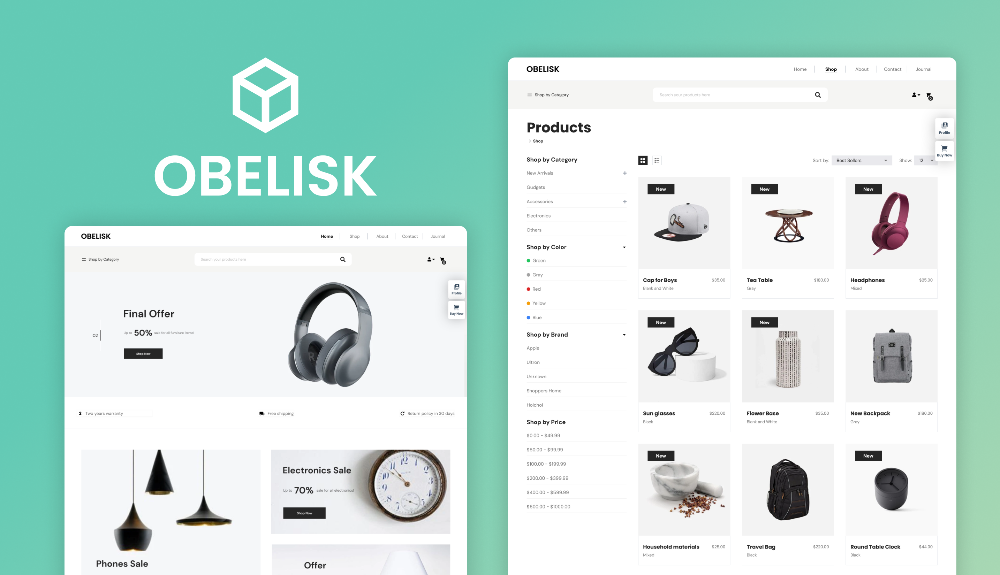

# OBELISK
> A modern [React](https://react.dev/) e-commerce web application for an online store, built with Redux, and Tailwind CSS.


---

## 📸 Preview

<!-- Replace with an actual screenshot or GIF -->


---

## ✨ Features

- **Product Browsing:** A comprehensive shop page to browse through all available products.
- **Detailed Product View:** Click on any product to see a more detailed description, images, and pricing.
- **Advanced Search:** A search bar that provides real-time filtering of products as you type.
- **Shopping Cart:** Add and remove products from your cart, with the number of items always visible in the header.
- **User Account UI:** UI for signing up and signing in is implemented, but not connected to a backend.
- **Categorized Shopping:** Easily navigate through different product categories like "New Arrivals," "Best Sellers," and "Special Offers."
- **Product Filtering:** Refine your search by brand, category, color, and price to find exactly what you're looking for.
- **Paginated Results:** Product lists are broken down into multiple pages for easier browsing.
- **Checkout Page:** A placeholder checkout page is in place.
- **Responsive Design:** The website is fully functional and looks great on both desktop and mobile devices.

---

## 🚀 Live Demo

Check out the live version here:
**[🔗 Live Project](https://obelisk-jkv21.vercel.app/)**

---

## 🛠️ Tech Stack

- **UI Library:** [React](https://react.dev/) `^18`
- **State Management:** [Redux](https://redux.js.org/) `^1.9.2`
- **Styling:** [Tailwind CSS](https://tailwindcss.com/) `^3.2.4`
- **Routing:** [React Router](https://reactrouter.com/) `^6.6.0`
- **Deployment:** [Vercel](https://vercel.com/)

---

## 📁 Project Structure

```bash
├───public/             # Static assets (images, icons, etc.)
└───src/
    ├───assets/
    ├───components/         # Reusable UI components
    ├───constants/
    ├───pages/              # Application pages
    └───redux/              # Redux store and slices
```

---

## ⚙️ Getting Started

### ✅ Prerequisites

* Node.js (v18.x or later)
* npm / yarn / pnpm

### 🧰 Installation

1. Clone the repository:

   ```bash
   git clone https://github.com/jkvdev/obelisk.git
   ```
2. Navigate to the project directory:

   ```bash
   cd obelisk
   ```
3. Install the dependencies:

   ```bash
   npm install
   ```

### 🔐 Environment Variables

This project does not require any environment variables.

### ▶️ Running the Development Server

```bash
npm run start
```

Visit [http://localhost:3000](http://localhost:3000) to view it in your browser.

---

## 💡 Key Learnings & Challenges

* Implemented a **global state management** system with **Redux** to handle the **shopping cart** functionality.
* Utilized **React Router** for creating a **multi-page application** with seamless navigation.
* Built a **responsive** and **mobile-first** user interface with **Tailwind CSS**.
* Focused on creating a clean and reusable **component-based architecture**.

---

## 🗺️ Roadmap

* [ ] Implement a full-fledged backend with user authentication and order management.
* [ ] Connect the application to a real database to manage products and inventory.
* [ ] Integrate a payment gateway for processing transactions like Stripe.
* [ ] Add unit and integration tests to ensure code quality.
* [ ] Add a dark mode feature.

---

## 📝 License

This project is licensed under the MIT License. See the [LICENSE](LICENSE) file for details.

---

## 📬 Contact

**Valentin Costea** – [Portfolio](https://jkvdev.com) – [jkv21contact@gmail.com](mailto:jkv21contact@gmail.com)